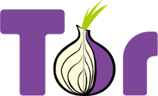
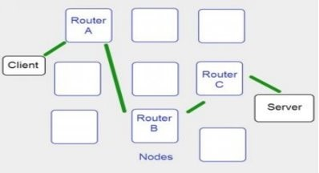
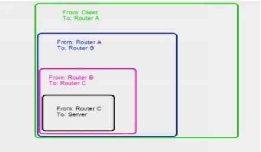

<p align="center">
  <a href="https://example.com/">
    
  </a>

  <h3 align="center">Báo cáo mã hóa</h3>

  <p align="center">
    Nhóm 10
    <br>
    19120089 - Lê Ngọc Lâm
    <br>
    19120022 - Vũ Đào Hoàng Long
    <br>
    19120256 - Nguyễn Võ Anh Khoa
    <br>
    19120553 - Chung Hoàng Tuấn Kiệt
  </p>
</p>


## Nội dung

- [Tor](#tor)
- [DarkWeb](#darkWeb)
- [How to be anonymous online](#how-to-be-anonymous-online)

## Tor
Sơ lược cách hoạt động internet và server-clients​
- Internet là một chuỗi kết nối các máy tính.​
- Dữ liệu được lưu trữ trên internet thường được lưu trữ trong  các server. Client kết nối đến server để nhận dữ liệu. Dữ liệu được di chuyển trên internet trong các gói chứa thông tin về nguồn và đích.​

Giới thiệu

 
- TOR là một công cụ cho phép duyệt web với tư cách là một người ẩn danh.​
- TOR ban đầu là viết tắt của The Onion Router, thực hiện phân thức giao tuyến kiểu củ hành thế hệ thứ hai.

TOR hoạt động như thế nào?​

- Mạng Tor được tạo thành từ các tình nguyện viên biến máy tính của họ thành các nodes.​

- Tor tạo ra các đường dẫn thông qua các nodes, được gán ngẫu nhiên, để khi bạn truy cập internet bằng Tor các gói tin sẽ được gửi qua các đường dẫn trước khi đến server.​
- Các gói tin cũng được thiết kế khác để di chuyển trong mạng Tor. Gói tin sẽ được bao phủ bởi các lớp gói tin tuần tự.​

Tor thực sự hoạt động như thế nào?​
- TOR chuyển kết nối của bạn đến các máy tính trung gian, còn được gọi là relay.​
- Có khoảng 6000 relay được tìm thấy và được điều hành bởi các tình nguyện viên.​
- TOR được tạo ra để trả lại các kết nối thông qua ba loại relay và mỗi relay này chứa một vai trò cụ thể.​

Ba loại relay
- Relay nhập​: Đại diện điểm vào mạng TOR, relay được chọn vai trò bảo vệ.​
- Relay giữa​: Được sử dụng để truyền tải lưu lượng từ relay lối vào đến relay lối ra. ​
- Relay thoát​: Hướng lưu lương truy cập đến đích cuối cùng mà client  dự định.​

<!-- Chèn ảnh vào đây: Ảnh tor (củ hành) + cách hoạt động -->
<!--  -->

## DarkWeb

Định nghĩa
- Deep web là một tập hợp con của internet. Deep web không thể truy cập bằng các trình duyệt thông thường. Ví dụ sử dụng TOR để truy cập chúng.​
- Dark web là một tập hợp con của deep web, được lập chỉ mục và cần một thứ gì đó đặc biệt để truy cập nó, ví dụ như: xác thực để được truy cập, phần mềm uỷ quyền cụ thể…​
- Các loại trang web này thường yêu cầu đóng góp trước khi sử dụng để giữ cho tài nguyên phát triển mạnh và có nội dung mới.​
- Deep web được chia làm 8 tầng và dark web được tính từ tầng thứ 3 trở đi.​


## How to be anonymous online

Giới thiệu
- Tính ẩn danh trực tuyến thực sự đòi hỏi nhiều thay đổi đối với quy trình kỹ thuật số của bạn, chẳng hạn như thay thế hệ điều hành, trình duyệt, công cụ tìm kiếm, ứng dụng nhắn tin và nhà cung cấp email. Dưới đây là 22 bước bạn cần thực hiện để ẩn danh trực tuyến.​

Sử dụng phần mềm nhắn tin được mã hóa
- Nếu muốn gửi tin nhắn văn bản trên các thiết bị di động, hãy sử dụng ứng dụng nhắn tin được mã hóa như Signal.​

- Với Signal, tất cả các thông tin liên lạc đều có mã hóa đầu cuối trên giao thức mã nguồn mở của nó. ​
Người khác không thể xem tin nhắn hoặc cuộc gọi của bạn và không có quảng cáo hoặc trình theo dõi.​

Sử dụng trình duyệt được mã hóa. ​
- Google nổi tiếng với việc thu thập dữ liệu phong phú. Thay vì sử dụng Chrome hoặc trình duyệt khác của một công ty công nghệ lớn, hãy sử dụng Tor, một trình duyệt bảo mật mã hóa địa chỉ IP và hoạt động web của bạn ba lần. Tuy nhiên, Tor không mã hóa bất kỳ ứng dụng web nào khác mà bạn sử dụng, đó là lý do tại sao bạn cũng cần VPN. Bạn hỏi [VPN là gì](https://www.security.org/vpn/what-is-a-vpn/)?​

Sử dụng VPN​
- [VPN](https://www.security.org/vpn/what-is-a-vpn/) là viết tắt của “mạng riêng ảo” và, không giống như Tor, [VPN mã hóa](https://www.security.org/vpn/encryption/) tất cả lưu lượng truy cập web từ các trình duyệt và các ứng dụng web khác. Ngoài việc [ẩn địa chỉ IP của bạn](https://www.security.org/vpn/hide-your-ip-address/) , [VPN](https://www.security.org/vpn/browsing-history/) còn ẩn lịch sử duyệt web của bạn để nhà cung cấp dịch vụ internet (ISP) không thể thấy bất kỳ hoạt động trực tuyến nào của bạn. Phần tốt nhất? Bạn có thể thiết lập [VPN](https://www.security.org/vpn/setup/) chỉ trong vài phút; kiểm tra cách truy cập trang [VPN](https://www.security.org/vpn/how-to/) của chúng tôi để biết thêm thông tin.​

Sử dụng các dịch vụ email an toàn​
- Vì chúng tôi đã tham gia rất sâu vào hệ sinh thái của Google, chúng tôi sử dụng Gmail làm nhà cung cấp email cá nhân của mình. Mặc dù chúng tôi thích tính dễ sử dụng của nó, nhưng chúng tôi không thích việc Google lưu giữ tất cả các email riêng tư của chúng tôi trên các máy chủ của nó. Tuy nhiên, có những tùy chọn an toàn như ProtonMail, cùng một công ty đã mang đến cho chúng tôi [ProtonVPN](https://www.security.org/vpn/protonvpn/review/) . ProtonMail có trụ sở tại Thụy Sĩ, một thành viên của liên minh giám sát Five Eyes, vì vậy công ty không thể bị buộc phải cung cấp dữ liệu khách hàng của chính phủ. Thay vào đó, tất cả email đều có mã hóa đầu cuối bằng mã nguồn mở và dịch vụ này miễn phí cho người dùng Android, iOS và web ​

Sử dụng một email tạm thời​
- Bạn không muốn một công ty gửi bản tin cho bạn hàng ngày? Sử dụng một địa chỉ email tạm thời. Các dịch vụ như Temp Mail tạo các địa chỉ email hữu ích miễn phí.​

Sử dụng bộ nhớ được mã hóa​
- Trở lại chuyến tàu của Google, chúng tôi lưu trữ tất cả tài liệu, ảnh và tệp của mình trong Google Drive, đây chắc chắn không phải là một lựa chọn tốt về mặt bảo mật. Tuy nhiên, một số nhà cung cấp dịch vụ lưu trữ đám mây sử dụng mã hóa end-to-end, như Sync, Tresorit và ProtonDrive, một người anh em họ với ProtonMail và ProtonVPN.​

Sử dụng trình duyệt được mã hóa. ​
- Google nổi tiếng với việc thu thập dữ liệu phong phú. Thay vì sử dụng Chrome hoặc trình duyệt khác của một công ty công nghệ lớn, hãy sử dụng Tor, một trình duyệt bảo mật mã hóa địa chỉ IP và hoạt động web của bạn ba lần. Tuy nhiên, Tor không mã hóa bất kỳ ứng dụng web nào khác mà bạn sử dụng, đó là lý do tại sao bạn cũng cần VPN. Bạn hỏi VPN là gì?​

​Kiểm tra quyền ứng dụng​
- Tất cả chúng ta đều có lỗi khi vô ý chấp nhận các điều khoản và điều kiện của ứng dụng, nhưng trước khi bạn chấp nhận, hãy xem ứng dụng có những quyền nào. Ví dụ: nó luôn cần biết vị trí của bạn hay bạn có thể tắt tính năng này không? Hầu hết các ứng dụng đều yêu cầu càng nhiều quyền càng tốt, vì vậy bạn có thể kiểm tra chúng hay không.​

Đọc chính sách bảo mật.​
- Tương tự, hãy kiểm tra dữ liệu mà một trang web hoặc ứng dụng thu thập, chia sẻ và / hoặc bán trước khi bạn sử dụng. Nhiều công ty bán thông tin cá nhân của người dùng cho bên thứ ba với mục đích tiếp thị và quảng cáo, điều này không có lợi cho quyền riêng tư chứ chưa nói đến việc ẩn danh.​

Sử dụng trình chặn quảng cáo
- [Phần mềm quảng cáo](https://www.security.org/antivirus/adware/) là phần mềm đặt quảng cáo trên máy tính, điện thoại hoặc máy tính bảng của bạn, nhưng ngay cả khi bạn không có phần mềm quảng cáo, hầu hết các trang web và ứng dụng đều có một số hình thức quảng cáo, điều này có thể gây khó chịu. Ngoài việc [loại bỏ phần mềm quảng cáo](https://www.security.org/antivirus/remove-adware/) , bạn có thể sử dụng trình chặn quảng cáo như AdBlock hoặc Adblock Plus.​

Không sử dụng trợ lý giọng nói​
- Trợ lý giọng nói giúp [tự động hóa ngôi nhà](https://www.security.org/smart-home/home-automation/) thuận tiện trong [ngôi nhà thông minh](https://www.security.org/smart-home/) của bạn . Tuy nhiên, chúng nổi tiếng là xấu về quyền riêng tư. Chẳng hạn, nhân viên của Amazon đã thừa nhận đã nghe bản ghi âm Alexa và có một micrô ẩn, không tiết lộ trong hệ thống bảo mật [Nest Secure](https://www.security.org/home-security-systems/nest-security/review/) tương thích với Trợ lý Google . Đặt cược tốt nhất của bạn là tránh xa trợ lý giọng nói và tiếp tục kiểm soát [đèn thông minh](https://www.security.org/smart-home/smart-lights/) , [nhà để xe thông minh](https://www.security.org/smart-home/smart-garage-door/) , [khóa thông minh](https://www.security.org/smart-locks/) và các thiết bị IoT khác theo cách thủ công thông qua ứng dụng của bạn.​

Tránh xa mạng xã hội​
- Trong [nghiên cứu của chúng tôi về phương tiện truyền thông xã hội và cách nuôi dạy con cái](https://www.security.org/digital-safety/parenting-social-media-report/) , chúng tôi nhận thấy rằng hơn ba phần tư các bậc cha mẹ chia sẻ những câu chuyện, hình ảnh hoặc video về con cái của họ trên mạng xã hội. Tệ hơn nữa, hơn 80 phần trăm các bậc cha mẹ này sử dụng tên thật của con mình trong các bài đăng này. Điều này không chỉ khiến con cái của họ có nguy cơ bị [đánh cắp danh tính trẻ em](https://www.security.org/digital-safety/child-identity-theft/) , mà các công ty truyền thông xã hội còn lưu giữ dữ liệu này trong thời gian dài. Đặt cược tốt nhất cho sự riêng tư của bạn là tránh hoàn toàn các phương tiện truyền thông xã hội.​

Sử dụng proxy​
- Khi nói đến VPN so với máy chủ [proxy](https://www.security.org/vpn/proxy-vs-vpn/), máy chủ proxy tốt hơn cho các mạng đang di chuyển mà bạn chỉ sử dụng một lần. Không giống như VPN, máy chủ proxy chỉ mã hóa địa chỉ IP của thiết bị chứ không phải lưu lượng truy cập web của bạn, khiến chúng kém an toàn hơn (nhưng thường miễn phí)​

Kiểm tra HTTPS​
- Nếu có thể, chỉ truy cập các trang web có URL bắt đầu bằng “HTTPS” thay vì “HTTP”. HTTPS, viết tắt của “giao thức truyền siêu văn bản an toàn”, sử dụng lớp cổng bảo mật (SSL) để mã hóa tất cả thông tin liên lạc giữa trình duyệt của bạn và các trang web bạn truy cập, trong khi HTTP thì không.​

Tắt cookie​
- Bạn có nhớ khi chúng tôi đề cập đến những quảng cáo theo dõi bạn trên internet như một kẻ theo dõi bạn trai cũ không? Cookie là dữ liệu về các hoạt động trực tuyến của bạn để định hình các quảng cáo được nhắm mục tiêu; đôi khi chúng được ẩn danh và tổng hợp, nhưng đôi khi không.​

Không sử dụng Google​
- Chúng tôi sẽ nói lại lần nữa: Google theo dõi mọi thứ bạn tìm kiếm trực tuyến, đó có thể là thông tin rất cá nhân. Thay vì Googling, hãy duyệt web bằng công cụ tìm kiếm như DuckDuckGo, công cụ này không thu thập thông tin cá nhân của bạn để tạo quảng cáo được nhắm mục tiêu. Thay vào đó, dịch vụ tạo quảng cáo dựa trên những gì bạn tìm kiếm và tất cả dữ liệu tìm kiếm đều được ẩn danh, cũng như địa chỉ IP​


​Sử dụng hệ điều hành an toàn​
- Nếu ẩn danh trực tuyến của bạn là một tòa nhà, thì hệ điều hành của bạn là nền tảng. Ngay cả với máy chủ email an toàn, trình duyệt, công cụ tìm kiếm, v.v., nếu bạn đang sử dụng hệ điều hành từ một công ty công nghệ lớn, dữ liệu của bạn vẫn có thể được ghi lại. Ngược lại, một hệ điều hành mã nguồn mở như Linux lại ngăn cản người dùng. Tails và Whonix là một số tùy chọn hệ điều hành an toàn khác.​

Vô hiệu hóa JavaScript​
- JavaScript là một ngôn ngữ lập trình cho phép tạo đồ họa động, bản đồ tương tác và các tính năng đặc biệt khác trên các trang web. Thật không may, tin tặc có thể khai thác các lỗ hổng trong JavaScript để sửa đổi và đánh cắp dữ liệu người dùng 8 , vì vậy tốt nhất bạn nên vô hiệu hóa nó, đặc biệt nếu bạn đang sử dụng trình duyệt phổ biến như Chrome hoặc Firefox.​


<!-- ```text
folder1/
└── folder2/
    ├── folder3/
    │   ├── file1
    │   └── file2
    └── folder4/
        ├── file3
        └── file4
``` -->
## Creators

**Creator 1**

- Chung Hoang Tuan Kiet

## Thanks

Some Text

## Copyright and license

Code and documentation copyright 2011-2018 the authors. Code released under the [MIT License](https://reponame/blob/master/LICENSE).

Enjoy :metal:
